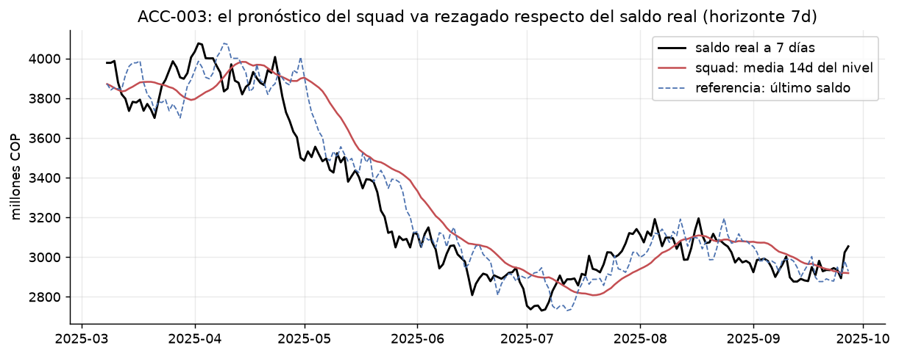
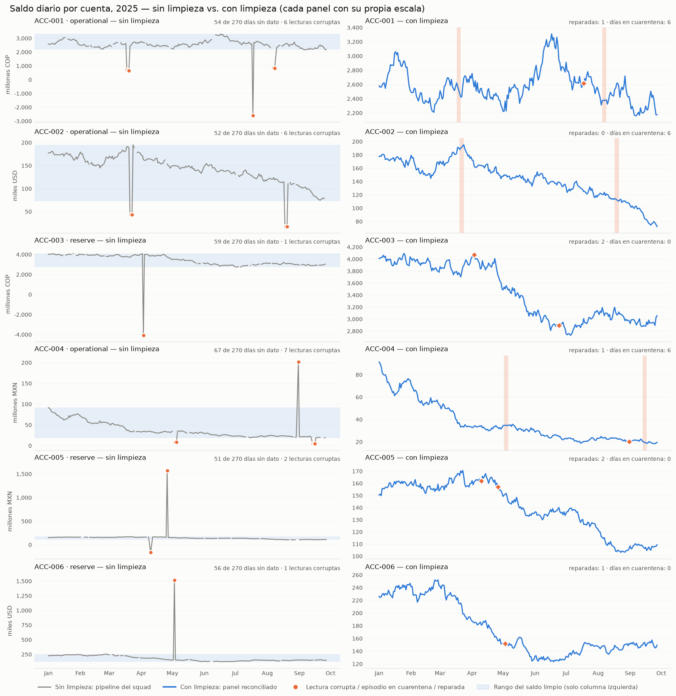
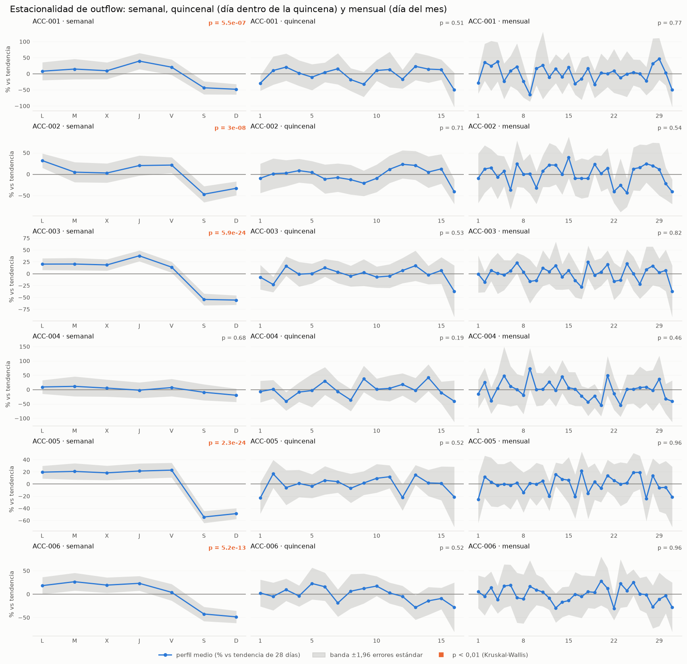
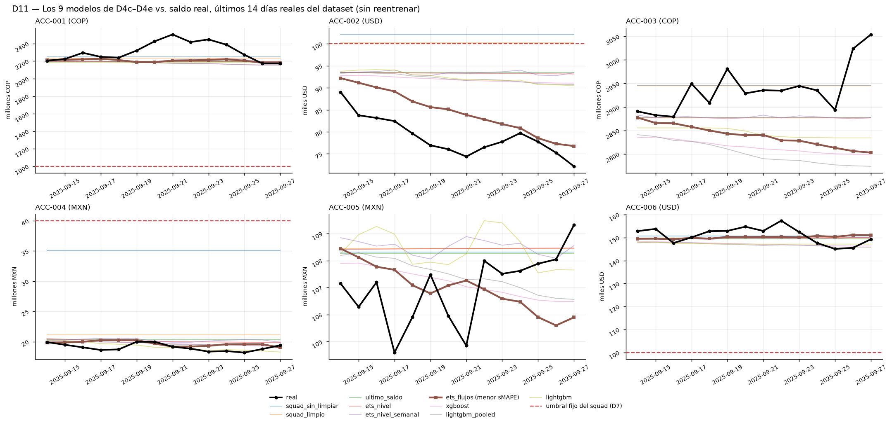
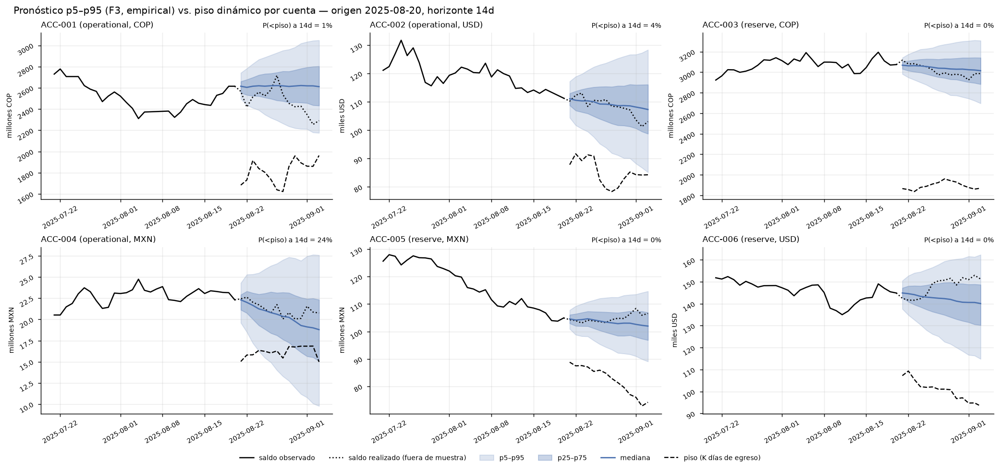
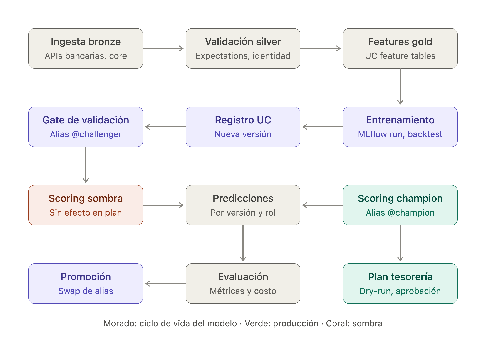

# Multi-Bank Liquidity Engine — Development Walkthrough

This is the English, step-by-step account of the work behind this repository, written for
reviewers who prefer a narrative walkthrough over the (Spanish) [`README.md`](README.md) or the
notebook itself. It documents *how* the solution was built, in the order it was built, with a
figure at each step. The technical deliverable is
[`notebooks/flawed_model_squad_draft_v4_es.ipynb`](notebooks/flawed_model_squad_draft_v4_es.ipynb);
all of its logic lives in [`src/`](src/), covered by 59 `pytest` tests. Every figure and number
below is quoted from that notebook, not guessed at — including the D11/D12 analysis and the
self-caught sizing bug fix folded into Steps 4b and 5b.

## The problem in one paragraph

A fintech holds balances across 6 accounts in 3 currencies (COP, USD, MXN) at different banks.
Money needs to move between them *proactively* — before a shortfall blocks a payment, or a
surplus sits idle. A squad's first attempt (`data/raw/flawed_model_squad_draft.ipynb`) "runs
without error" and concludes it's working. It isn't. This project diagnoses why, fixes it, and
proposes a new method: a probabilistic forecast of net cash flow feeding a two-layer rebalancing
engine (an explainable quantile policy and a rolling-horizon MILP).

---

## Step 1 — Reproduce the squad's notebook as evidence

Rather than assuming what was wrong, the squad's notebook was run unchanged, on the raw data, and
its output measured. Every defect claimed later (`D1`–`D10` in Part 1 of the notebook) is backed
by a number produced this way — not a description of what "looks off" in the code.



*The squad's "forecast" is a 14-day trailing average of the balance **level**: no drift, no
seasonality, no uncertainty band — it simply follows the actual balance a few days late.*

Key findings from this reproduction:
- A silent `dropna()` after `pd.to_datetime(..., errors="coerce")` drops **17.6% of all rows**
  (every non-ISO date), not "a few" as the original code comment claims.
- 9 currency labels (`cop`, `Colombian Peso`, `USD`, `US Dollar`, …) are treated as 9 distinct
  currencies instead of 3.
- The rebalancing rule picks the "donor" account by **nominal balance**, without FX conversion.
- Fixed thresholds are hardcoded for only 4 of the 6 accounts — the two accounts that actually
  went negative in the data are invisible to the rule.
- The rule ignores settlement lag (`transfer_today: True`) and fees.
- "Validation" is a before/after average that **sums COP + USD + MXN** into one number.

## Step 2 — Fix the data with the accounting identity

The correction doesn't guess at fixes; it uses the one thing that must hold in every healthy row:

```
balance[t] = balance[t-1] + inflow[t] - outflow[t]
```

This identity is used three ways in [`src/ingest.py`](src/ingest.py) and
[`src/quality.py`](src/quality.py): to pick the correct value between two conflicting duplicate
rows for the same `(account, date)`, to reconstruct missing values, and to detect sign/scale
errors by their exact numerical signature. Whatever the identity **cannot** explain is routed to
a marked quarantine — it is never silently dropped or guessed at.



*Daily balance per account, before cleaning (raw parsing artifacts, gaps, duplicates) vs. after —
a clean 6-account × 270-day panel with 0 nulls, 0 negatives, and a reconciliation residual of
≈0.01.*

## Step 3 — Understand the flow structure before modeling it

Before choosing a forecasting model, the actual structure of the cash flows was characterized:
which components carry a real, exploitable pattern, and which are closer to noise.



*Outflow drops sharply on weekends in 5 of 6 accounts (Kruskal-Wallis `p < 0.01`, orange) — a real,
usable weekly pattern; `ACC-004` is the one exception (`p = 0.68`), the same account the squad's
own notebook flagged as unreliable. Neither the fortnightly nor the monthly cut clears significance
anywhere. The balance **level** itself carries ~0 of this pattern — it's a stock, not a flow — which
is exactly why Step 4 forecasts net flow, not level.*

## Step 4 — Build a probabilistic forecast of net flow, not balance level

The forecast target is the **net flow**, not the balance **level** — Step 3 already shows why: the
weekly pattern lives in the flows, and the level (their cumulative sum) washes it out. The engine
runs on an empirical bootstrap of net-flow residuals (`B.ForecastStore(flows, "empirical")`), which
delivers a distribution, not a point — `Q_α` quantiles over the decision horizon, which is what the
rebalancing engine actually consumes.

**Caveat on how "empirical" was chosen.** The notebook's own prose (ahead of `D12`) still refers to
"the model ladder in 2.3 (further below)" — naive-seasonal → ETS → SARIMAX → Prophet → empirical
bootstrap, picked by pinball loss — but section `2.3` isn't in the current notebook; that
comparison, and the two figures that used to illustrate it, aren't reproducible from it today. The
choice isn't unfounded, though: `D4c` validates ETS against the squad's rule and the naive
"tomorrow = today" baseline with walk-forward `TimeSeriesSplit` (no lookahead), and — more directly
— **Step 4b/D12 below is live evidence for `empirical`**: it's run head-to-head against `ets` inside
the actual rebalancing engine, on real dollar cost, not just an error table.

## Step 4b — Does the most accurate point forecast win the decision that follows?

Before trusting `empirical` (Step 4's winner by pinball loss) as the engine's forecast source, two
more checks close the loop: does *point* accuracy matter here, and does the squad's own fixed
threshold (`D7`) survive genuinely out-of-sample forecasts, not just historical medians?

**D11 — nine point-forecast models, scored on the last 14 real days of the dataset** (the final
`TimeSeriesSplit` fold, trained only through `2025-09-13`, no retraining, no leakage): the six
models from Step 4's ladder plus XGBoost, LightGBM (pooled), and LightGBM (tuned per account, via
Optuna, with its inner CV verified — by test — to end before the outer test fold starts).



*`ets_flujos` (ETS on inflow/outflow separately, thick brown line) wins on aggregate sMAPE
(3.74% vs. 5.34% for the runner-up, LightGBM) by being the most consistent across accounts, not the
sharpest on any single one. But the more load-bearing result is the red dashed line: on
`ACC-002` and `ACC-004`, every model — and the real balance itself — stays under the squad's fixed
threshold (`D7`) for all 14 of 14 days. That's not a forecasting failure; it quantitatively
confirms `D7` with genuinely out-of-sample forecasts: those two thresholds are miscalibrated, and
no forecast improvement fixes that — only replacing the fixed threshold with the dynamic floor
(`K` × trailing average outflow, Step 5) does.*

**D12 — the D11 winner doesn't win the engine.** `ets_flujos` produces a point forecast with no
distribution — it can't answer "how bad could this get?" Its closest probabilistic relative in the
Step 4 ladder is `ets` (an additive ETS on net flow with a bootstrap residual distribution), and
`ets` is measurably worse than `empirical` on the metric that actually sizes a buffer: 0.738 vs.
0.664 relative cumulative pinball loss (~11% worse), 92.5% vs. 93.5% empirical coverage. Swapping
`empirical` → `ets` inside the *same* rebalancing engine (quantile policy and MILP, unchanged)
confirms this isn't just a table of error metrics:

| Policy | Forecast | Transfers | Cost (USD) | Account-days short |
|---|---|---|---|---|
| Quantile policy | `empirical` | 49 | 4,955 | 0 |
| Quantile policy | `ets` | 71 | **9,044 (+83%)** | 1 |
| MILP | `empirical` | 22 | 2,099 | 0 |
| MILP | `ets` | 44 | **4,839 (+131%)** | 0 |

The model that wins point accuracy (D11) doesn't win the question the engine actually decides on:
how well-calibrated the tail of the distribution is. `empirical` loses on MAPE/sMAPE to
`ets_flujos` (D11) but, of the two forecasts actually run through the engine, is the one that
clears the shortfall at the lower cost — the same lesson as `D5` and Step 4, now confirmed by
running D11's own top candidate through the engine rather than reading its error table.

## Step 5 — Design the two-layer rebalancing engine

On top of the same probabilistic forecast, two decision layers are built
([`src/policy.py`](src/policy.py), [`src/optimize.py`](src/optimize.py)):

1. **Quantile policy** — transfer when a low quantile of the projected balance breaches the
   operational floor. Simple, explainable to Treasury in one sentence.
2. **Rolling-horizon MILP** — a 14-day mixed-integer program, re-optimized daily, that minimizes
   `fee + fixed cost + expected deficit penalty`. It decides explicitly, day by day, account by
   account, whether it is cheaper to transfer or to absorb the expected penalty of staying short.

The operational floor (`K = 25` days of average outflow) is not an arbitrary constant — it's a
declared assumption in [`src/config.py`](src/config.py), chosen so the aggregate system-wide
surplus stays comfortably positive: at `K = 30` it collapses to where the problem stops being about
rebalancing and becomes a funding problem. **Caveat:** the sweep behind that number
(`diagnosis.system_surplus_by_k`) is not called anywhere in this notebook — it's inherited from
`src/config.py`'s comment and an earlier draft; reproducing it here is still open work.



*The trigger's actual input, per account, from a single real origin (`2025-08-20`): the p5–p95 fan
against the dynamic floor (dashed), with the probability of breaching it by day 14 annotated —
`ACC-004` at 24% is the one to watch here, `ACC-003`/`ACC-005`/`ACC-006` at ~0%. This is the figure
`2.8b` in the notebook produces from the exact forecast store used everywhere else in this section.*

## Step 5b — A verification catch: the sizing function was reading the wrong number

`P.target_buffer` — the function that sizes *how much* to transfer once the trigger fires — has its
own drift term, `mu_burn`, meant to size for a sustained daily loss on top of tail risk. Reviewing
its output for a real case (`2025-05-06`) surfaced that `mu_burn_diario` was `0` (or `-0.0`) for
*every* account, at *every* origin — not a plausible result once the underlying flows visibly
trend downward across the whole panel.

**Root cause:** the original code read the drift off `forecast.mean` — the point forecast. For
`empirical` (the forecast this whole engine is built on, confirmed the right choice in Step 4b),
the point forecast is defined to be exactly `0` **by design**, as a sanity check inside
[`src/forecast.py`](src/forecast.py) — not because the flow has no drift. The real drift lives in
the bootstrap sample paths (`paths`) computed two lines earlier in the same function, and was never
being read. Swept across origins, `paths.mean()` is never zero — e.g. −COP 1.06M/day on `ACC-001`,
−COP 4.68M/day on `ACC-003`.

**Fix** ([`src/policy.py`](src/policy.py)): `mu_burn = max(-paths.mean(), 0.0)`, reusing the
`paths` array already drawn — no extra sampling cost. All 59 tests stayed green.

| Account | `mu_burn_diario` before | `mu_burn_diario` after | Required amount before | Required amount after |
|---|---|---|---|---|
| ACC-002 | 0 | 254 USD/day | USD 11,342 | USD 14,898 (+31%) |
| ACC-004 | 0 | 373,051 MXN/day | MXN 10.15M | **MXN 15.37M (+51%)** |
| ACC-006 | 0 | 674 USD/day | USD 32,689 | USD 42,125 (+29%) |

`ACC-004` — the same account flagged with real funding problems in `D6`/`D7` — is where this bites
hardest: the bug was understating the required transfer by 34%.

**What this bug did *not* touch:** `target_buffer` is a demonstration function for this notebook
section; neither `QuantilePolicy` nor `LPPolicy` calls it (confirmed by `grep` across `src/`), so
the backtest cost figures in Step 6 (USD 2,099 for the MILP, etc.) are unaffected. The fix only
changes this one illustrative worked example — but for that example, it changed the conclusion.

## Step 6 — Backtest with counterfactuals

The squad's rule, the quantile policy, and the MILP are all run over the **same** 210-day
history and the **same** forecast, and measured **per currency** (never summed across COP, USD,
MXN) with [`src/backtest.py`](src/backtest.py):

| Policy | Account-days short | Cost (USD) | Transfers |
|---|---|---|---|
| No intervention | 33 | 0 | 0 |
| Squad's rule | 86 (worse than doing nothing) | 6,275 | 200 |
| Quantile policy | 0 | 4,955 | 49 |
| **MILP** | **0** | **2,099** | **22** (all same-currency) |

The MILP also actively *decides not to transfer* 324 times in the backtest when the cost of
moving money exceeds the expected penalty of staying short — with 0 shortfalls resulting from
those decisions.

## Step 7 — Stress the result before trusting it

`src/backtest.py` implements this sweep (`sensitivity()`, `LP_PENALTY_GRID`,
`SENSITIVITY_FX_SHOCK`), but — like the `K = 30` sweep in Step 5 — it isn't called from any cell in
the current notebook; the numbers below are from an earlier run (`CONCLUSIONES_Y_PENDIENTES.md`),
not this one. Re-running it here is open work, same as the model-ladder gap in Step 4.

- **Robust** to FX ±10% and to a forced settlement lag.
- **Fragile** to an optimistically biased forecast: 1–3 account-days short reappear.
- **Not a rebalancing problem at K = 30**: the system no longer has enough aggregate liquidity —
  that's a funding decision, not something a smarter transfer engine can fix.

## Step 8 — Explain the same result to two audiences

**To the squad's data scientist (technical):** the fix is modeling net flow instead of level, a
model ladder validated walk-forward with no leakage (the empirical bootstrap wins because the
value is in the distribution, not the mean), and a two-layer decision engine on top of that
forecast. All business assumptions (floor, fees, lag, penalty, FX) live in one place,
[`src/config.py`](src/config.py), never as loose constants in modeling code. The main way this can
fail: the bootstrap assumes historical residuals by day-type represent the future well — a real
regime change isn't captured, and that's the sensitivity that hurts most.

**To Treasury (non-technical):** every day, the system checks whether any account will run short
before a new transfer would arrive, and if so, moves only what's needed from the account with the
most spare cash, preferring the cheapest and fastest source. Applied to the same history, the
squad's model left 86 account-days short — worse than doing nothing. The new approach leaves
**zero**, at **less than half the cost** (~$2,100 vs. $6,300), using 22 transfers instead of 200.
One thing to actively validate: the system sometimes chooses to **not** transfer and accept a
small penalty when moving money would cost more — that decision is only as good as the assumed
penalty rate, and Treasury should confirm it. Residual risk: the forecast reflects ~9 months of
history and won't anticipate a new large client or a regulatory change; 6 unexplained balance
drops and 140 logged transfers that don't reconcile with the balances remain open questions.

## Step 9 — Where AI was used, and where it deliberately wasn't

- **Used:** implementation of the reconciliation pipeline, the format-aware date parser,
  backtests, the policy simulator, and visualizations — all built against an explicit spec; test
  scaffolding (assertions dictated by the spec, e.g. accounting identity, uniqueness, ranges);
  code quality/linting; critical review and condensation of earlier drafts; grounding the
  rebalancing band in inventory theory (the (s, S) policy, Arrow–Harris–Marschak) for
  justification; wording and copyediting.
- **Deliberately not used:** the problem specification and acceptance criteria; the business
  assumptions (floor, fixed cost, penalty) and the recommended operating point; the reading of
  results and the recommendation to Treasury. **AI computes; it doesn't decide how much risk is
  acceptable.**
- **Verification, not blind trust:** nothing was accepted because "it ran without error" — that
  is exactly the original notebook's failure mode. Every output was checked against the spec: the
  accounting identity to the cent, cross-counts against the raw data, calibration kept separate
  from evaluation. This process caught and fixed real errors, including a policy that was
  ping-ponging money between accounts (fixed with a donor safety margin) and a band that crossed
  currencies too often (fixed by sizing donor capacity off its median and reserving FX crossings
  for whole-pool shortfalls).

## Step 10 — From notebook to production

Deploying this is not in scope for the take-home, but here is how it would move from a notebook
to something that runs reliably in production, covering data pipeline, cadence/orchestration,
monitoring, and safeguards.

### 10.1 Operational objective

Run the liquidity forecast at 7- and 14-day horizons on a schedule, to drive funding decisions and
capital rebalancing across accounts — minimizing bank fees, avoiding shortfall penalties, and
maximizing operational efficiency.

### 10.2 Data pipeline and ingestion

Data comes directly from banking APIs and the balances/movements core — not static files — under
versioned data contracts. Orchestration runs daily after bank close as a DAG (Airflow or Dagster):

```
Ingestion → Validation → Forecast → Optimization/Policy → Plan generation → Approval
```

Before inference, blocking quality gates apply:
- **Format and normalization** — a cascading date parser halts the run on any format
  inconsistency, instead of silently coercing and dropping rows.
- **Integrity** — uniqueness of `(date, account)` and currency alignment against the central
  catalog.
- **Accounting identity (zero-loss principle)** — `balance[t] = balance[t-1] + inflow − outflow`;
  any residual above 1 unit halts the run.
- **Freshness and plausibility** — same-day data required for 100% of accounts, plus range checks
  on balances and FX rates. Anomalous or incomplete records go to a marked quarantine, never a
  silent drop.

### 10.3 Inference, degradation monitoring, and drift alerts

Each cycle produces rolling 7- and 14-step forecasts. Model health is tracked on three axes:

1. **Performance** — MAE, sMAPE, RMSE on 7- and 30-day rolling windows, production vs. training.
2. **Intervals and bias** — pinball loss per account/interval; alerting if empirical p5–p95
   coverage drifts outside an 85–95% band; monitoring directional bias to avoid systematic over-
   or under-funding.
3. **Drift and business signal** — Population Stability Index (PSI) on net flows vs. a baseline
   window to catch structural breaks; real vs. predicted shortfall rate; actual transfer
   settlement latency; executed vs. budgeted fees.

### 10.4 Continuous retraining

Retraining is triggered by performance/drift breaches (MAE/RMSE beyond tolerance, or PSI
signaling a distribution shift) or on a calendar schedule via bootstrap over an expanding window.
Feature engineering explicitly includes business-day/holiday calendars, pay-period effects, and
month/quarter closes, with filtering to isolate one-off liquidity shocks (e.g., extraordinary
capital contributions) so they don't distort the seasonal signal. Every new model version must
win a **Champion–Challenger** evaluation before it can replace the one in production.

### 10.5 Safeguards, governance, and the deployment architecture

The system runs in **dry-run mode by default**: it produces recommendations, not actions —
explicit human approval from Treasury is required, especially above defined risk thresholds. A
continuous post-settlement reconciliation compares executed positions against the recommended
plan. If monitoring shows degradation, stale sources, or elevated bias, the system falls back to a
kill switch or a conservative rules-based manual mode. Every generated plan, with its reasoning and
assumptions, is archived immutably for audit.

This is the shape of the Champion–Challenger / shadow-deployment architecture that implements
the safeguards above, built on Databricks + MLflow + Unity Catalog:



*How it reads, left to right, top to bottom:*
- *Bronze → Silver → Gold — data lands raw from bank APIs/core (bronze), is validated against
  expectations and the accounting identity (silver), and turned into Unity Catalog feature tables
  (gold).*
- *Training → Registry — each training run is logged to MLflow (metrics, backtest results) and
  registered as a new model version in Unity Catalog.*
- *Validation gate → `@challenger` — a new version only earns the `@challenger` alias after
  passing the automated validation gate.*
- *Shadow vs. champion scoring — the `@challenger` scores every cycle in **shadow mode**,
  producing predictions tagged by version and role that have **no effect on the live plan**; the
  `@champion` (current production alias) scores in parallel and its predictions are what actually
  feed the Treasury plan (dry-run, pending approval).*
- *Evaluation → Promotion — challenger vs. champion predictions are compared on metrics and cost;
  only a statistically significant win promotes the challenger by an alias swap, with zero
  downtime and no redeployment.*

## Pending human decisions

None of these are guessed at in the code — they're declared assumptions in
[`src/config.py`](src/config.py), marked `[DECISIÓN HUMANA]` where they are a default pending
Treasury sign-off:

- The operational floor `K` (currently 25 days of average outflow).
- The official COP exchange rate (currently an approximate 3,900, not an official rate).
- The fixed transfer cost (USD 25) and the deficit penalty (0.2% of the shortfall per
  account-day).
- The 6 balance-drop episodes in quarantine that no rule currently explains.
- What the 140 logged transfers represent, since they don't reconcile against the balance series.

## Repository map

```
data/raw/         immutable originals: accounts.csv, account_balances_daily_RAW.csv,
                  transfers_log_RAW.csv, and the squad's original notebook (kept as evidence)
data/processed/   generated by `python -m src.ingest` (panel.csv, transfers_clean.csv)
notebooks/        flawed_model_squad_draft_v4_es.ipynb  <- the deliverable (imports from src/)
src/config.py     business assumptions and constants — the single source of truth
src/ingest.py     ingestion and accounting reconciliation
src/quality.py    data-quality report
src/features.py   features and transfer-log reconciliation
src/forecast.py   model ladder, bootstrap, walk-forward backtest
src/policy.py     account state, quantile policy, squad's original rule
src/optimize.py   rolling-horizon MILP (scipy/HiGHS)
src/backtest.py   simulator, per-currency metrics, cost-risk frontier, sensitivity
src/diagnosis.py  Part 1 evidence (D1–D10)
src/plots.py      all figures under reports/figures/
tests/            59 pytest tests
```

## Commands

```
python -m pytest              # run the test suite
python -m src.ingest          # regenerate data/processed/ and print the quality report
jupyter nbconvert --to notebook --execute --inplace notebooks/flawed_model_squad_draft_v4_es.ipynb   # ~5-6 min
```
